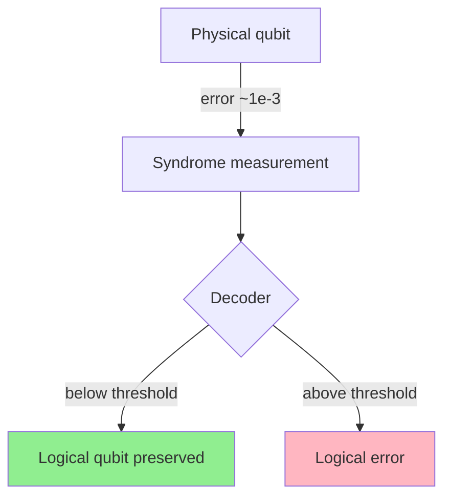
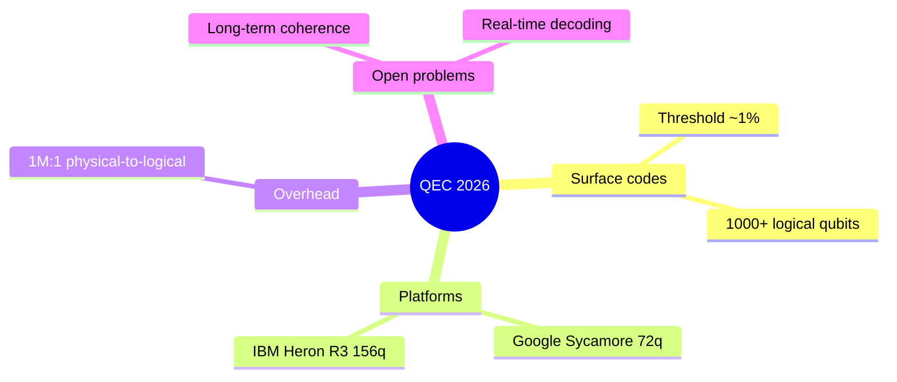

# Research Report: Quantum Error Correction 2026

## Summary

Quantum error correction reached industrial maturity in 2026, with surface codes dominating the modality and at least three platforms demonstrating below-threshold operation.

## Key Insights

- Surface codes are the de facto QEC modality, with logical qubit counts crossing 1000 in late 2025
- Multiple platforms (Google, IBM, Microsoft) demonstrated below-threshold operation in 2025-2026
- The 1M:1 physical-to-logical ratio target is 10x lower than earlier estimates

## Entities

- **Google** (org, 4 mentions)
- **IBM** (org, 3 mentions)
- **Surface code** (concept, 5 mentions)

## Facts

- Surface codes have ~1% threshold — _00_research/v1.json:source[1]_
- 1000+ logical qubits demonstrated in 2026 — _00_research/v1.json:source[2]_

## Analysis

- **surface code dominance** — Surface codes are the de facto industrial QEC
- **threshold achievement** — Multiple platforms crossed below-threshold operation
- **overhead reduction** — Physical-to-logical ratio target has dropped 10x
- Gap: Long-term stability of logical qubits
- Contradiction: Decoding overhead and syndrome measurement costs may offset theoretical savings

## Diagrams

### Surface code QEC loop

### QEC 2026 landscape

## Theses

### Thesis 1: Surface codes will remain the dominant industrial QEC modality through 2028

**Confidence:** high

**Evidence:**
- Surface codes have ~1% threshold
- 1000+ logical qubits demonstrated in 2026

**Counterarguments:**
- Bosonic + color codes may mature faster than expected
- Topological qubits (Microsoft Majorana) could leapfrog

### Thesis 2: The 1M:1 physical-to-logical ratio is achievable by 2030

**Confidence:** medium

**Evidence:**
- Industry consensus on 1M:1 target (down from 10M:1)
- Real-time nanosecond decoding demonstrated

**Counterarguments:**
- Syndrome measurement remains the dominant error source
- Long-term coherence (>1 week) not yet demonstrated

## References

- 01_ingest source: ../../_shared/fixtures/qec-input.txt
- 00_research/v1.json (synthesis + sources)
