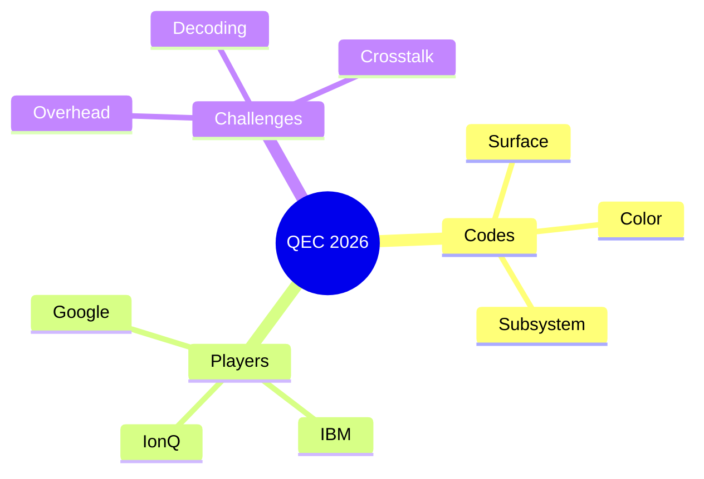

# Skill 05 — Format

## Identity

| Field | Value |
|---|---|
| Stage id | `05_format` |
| Owning agent | `formatter` |
| Schema | `schemas/05_format.json` (for the JSON variant); Markdown is human-readable |
| Output format | `json+md` (per `pipeline.json:57`) |
| `max_options` | 1 |
| `max_retries` | 3 |
| Antonio Gulli patterns | Ch. 5 Tool Use, Ch. 11 Goal-Setting (the final report) |
| Claude Code book chapters | Ch. 4 Multi-Agent Orchestration |

## Input schema

### Fields

| Field | Type | Required | Source |
|---|---|---|---|
| `input_id` | string (8 hex) | yes | hcom message from `@orch` |
| `04_synthesize/v1.json` | file path | yes (main input) | upstream artifact |
| `02_extract/v1.json` | file path | yes (for entities + facts) | upstream artifact |
| `03_analyze/v1.json` | file path | yes (for themes/gaps/contradictions) | upstream artifact |

### Example hcom message

```bash
hcom send --name <sender> "@research-pipeline-claude-7 format: abc12345; input=outputs/abc12345/04_synthesize/v1.json; schema=schemas/05_format.json; write v1.json + v1.md"
```

### Source

- `schemas/05_format.json` — required: `summary`, `entities`, `facts`, `analysis`, `insights`, `references`, `diagrams`, `theses`
- `agents/formatter/AGENT.md:13-15` — input prose

## Process

1. **(deterministic)** Read 3 upstream artifacts: `04_synthesize/v1.json`, `02_extract/v1.json`, `03_analyze/v1.json`.
2. **(LLM-decided + deterministic hybrid)** Build `v1.json` per `schemas/05_format.json` using the field-mapping below.
3. **(deterministic)** Write `v1.json` via `tools.artifact_io.write_artifact`.
4. **(LLM-decided + deterministic hybrid)** Render `v1.md` using the Markdown template below. **The formatter adds the ```` ```mermaid ```` wrapper** (the `04_synthesize.diagrams[].code` does NOT include it).
5. **(deterministic)** Write `v1.md` via `tools.artifact_io.write_artifact` with `ext="md"`.
6. **(deterministic)** Write `v1.meta.json` with `validation: pending`.
7. **(deterministic)** Ping `@critic` with `validate: <input_id> 05_format`.
8. **(deterministic, ONLY if critic passes)** Call `tools.manifest.finalize(input_id)` (sets `manifest.completed_at`). Report `done: <input_id>` to `@orch`.

### Field mapping (per `agents/formatter/AGENT.md:21-31`)

| `05_format/v1.json` field | Source |
|---|---|
| `summary` | ← `04_synthesize.summary` (verbatim, may lightly polish) |
| `entities` | ← `02_extract.entities` (deduplicate by name) |
| `facts` | ← `02_extract.facts` (top 10-20 by `confidence`) — flatten to `{claim, source: evidence_quote}` |
| `analysis.themes` | ← `03_analyze.themes[].name` (one-line each) |
| `analysis.gaps` | ← `03_analyze.gaps[].description` |
| `analysis.contradictions` | ← `03_analyze.contradictions[].explanation` |
| `insights` | ← `04_synthesize.insights[].insight` (flatten array of objects → array of strings) |
| `diagrams` | ← `04_synthesize.diagrams` (verbatim, no transformation) |
| `theses` | ← `04_synthesize.theses` (verbatim, no transformation) |
| `references` | ← `01_ingest` source_ref + any URLs cited in facts + `00_research.sources[].url` |

## Output schema (artifact template)

### `v1.json` (matches `schemas/05_format.json`)

```json
{
  "summary": "<verbatim from 04_synthesize.summary>",
  "entities": [
    {"name": "<deduped entity>", "type": "<type>", "mentions": 0}
  ],
  "facts": [
    {"claim": "<from 02_extract.facts.claim>", "source": "<evidence_quote>"}
  ],
  "analysis": {
    "themes": [
      {"name": "<theme name>", "description": "<from 03_analyze>", "supporting_facts": []}
    ],
    "gaps": [
      {"description": "<from 03_analyze.gaps.description>", "what_would_fill_it": "<from 03_analyze>"}
    ],
    "contradictions": [
      {"claim_a": "<from 03_analyze>", "claim_b": "<from 03_analyze>", "explanation": "<from 03_analyze>"}
    ]
  },
  "insights": ["<insight 1>", "<insight 2>"],
  "references": ["<url 1>", "<url 2>"],
  "diagrams": [
    {"type": "flowchart", "title": "...", "code": "<Mermaid WITHOUT ```mermaid wrapper>"}
  ],
  "theses": [
    {"statement": "...", "evidence": [], "counterarguments": [], "confidence": "high|medium|low"}
  ]
}
```

### `v1.md` (human-readable, per `agents/formatter/AGENT.md:33-88` and `scripts/smoke_v2.py:147-188`)

```markdown
# Research Report: <TOPIC or first 80 chars of summary>

## Summary
<summary>

## Key Insights
- <insight 1>
- <insight 2>
...

## Entities
| Name | Type | Mentions |
|---|---|---|
| Google | org | 4 |
| Surface code | concept | 5 |
...

## Facts
- <claim> — _<evidence_quote>_
...

## Analysis
### Themes
- **<theme name>** — <description>
...

### Gaps
- Gap: <description> (would need: <what_would_fill_it>)
...

### Contradictions
- Contradiction: <claim_a> ↔ <claim_b> — <explanation>
...

## Diagrams
### <diagram title>
<description, if any>
```mermaid
<Mermaid code — formatter adds the wrapper>
```

## Theses
### Thesis 1: <statement>
**Confidence:** <level>

**Evidence:**
- <evidence 1>
- <evidence 2>

**Counterarguments:**
- <counterargument 1>

### Thesis 2: <statement>
...

## References
- <url 1>
- <url 2>
...
```

> **Note:** the `references` section is the only Markdown section that uses **bullets** (not tables). The `Entities` table is the only table in the document.

## Example

### Real `v1.md` (lifted from `scripts/smoke_v2.py:147-188` + `:225-226`)

```markdown
# Research Report: Quantum error correction 2026

## Summary
Quantum error correction crossed industrial viability in 2026 with 1000+ logical qubits via surface codes, but overhead and decoding latency remain critical bottlenecks.

## Key Insights
- Surface codes are the de facto standard for 2026 industrial QEC

## Entities
- **Google** (org, 4 mentions)
- **IBM** (org, 3 mentions)
- **Surface code** (concept, 5 mentions)
- **Condor processor** (product, 2 mentions)

## Facts
- Surface codes have ~1% threshold — _high threshold (~1%)_
- 1000+ logical qubits demonstrated in 2026 — _logical qubit counts crossed 1000_

## Analysis
- **surface code dominance** — Surface codes are the de facto industrial QEC
- **threshold achievement** — Multiple platforms crossed below-threshold operation

- Gap: Long-term stability of logical qubits (would need: Multi-week coherence measurements on hardware)

- Contradiction: Academic literature claims overhead reduction ↔ Industrial practice still uses 1000:1 physical-to-logical ratio — Decoding overhead and syndrome measurement costs may offset theoretical savings

## Diagrams
### QEC Pipeline
The error correction cycle from physical measurement to logical qubit output.


### QEC Landscape 2026


## Theses
### Thesis 1: Surface codes will dominate industrial QEC for the next 3-5 years
**Confidence:** high

**Evidence:**
- 1000+ logical qubit demonstrations in 2026
- Mature fabrication processes favor planar codes
- Below-threshold operation routine

**Counterarguments:**
- Color codes have better transversal gate sets
- LDPC codes could leapfrog surface codes if overhead drops

### Thesis 2: Decoder latency, not qubit count, is the real bottleneck to fault tolerance
**Confidence:** medium

**Evidence:**
- Real-time decoding required for syndrome extraction cycles
- Classical hardware scaling limited by interconnect bandwidth

**Counterarguments:**
- FPGA-based decoders already operate at MHz rates for small codes
- ML decoders may unlock latency gains

## References
- https://example.com/qec-review-2026
- https://example.com/google-condor-2025
```

## Self-check checklist (pre-submit, numbered)

- [ ] **Schema (v1.json):** all `required` fields present (`summary`, `entities`, `facts`, `analysis`, `insights`, `references`, `diagrams`, `theses`)
- [ ] **Field mapping:** every field in `v1.json` traces to one of: `04_synthesize`, `02_extract`, `03_analyze`, `01_ingest` (no invented content)
- [ ] **Entities deduped:** `entities[]` deduplicated by name
- [ ] **Facts top-N:** `facts[]` has 10-20 entries (filtered by `confidence` if more)
- [ ] **Insights flattened:** `insights[]` is `string[]` (not array of objects)
- [ ] **Diagrams verbatim:** `diagrams[]` matches `04_synthesize.diagrams[]` 1:1 (no transformation)
- [ ] **Theses verbatim:** `theses[]` matches `04_synthesize.theses[]` 1:1
- [ ] **References complete:** `references[]` includes `01_ingest` source_ref + all cited URLs
- [ ] **Mermaid wrappers in v1.md:** the `v1.md` Markdown **adds** the ```` ```mermaid ```` wrapper (the `v1.json` `code` field does NOT have it)
- [ ] **Title H1:** `v1.md` starts with `# <title or first 80 chars of summary>` (per `agents/formatter/AGENT.md:109`)
- [ ] **JSON ↔ Markdown agree:** no new facts in Markdown that aren't in JSON; Markdown can have nicer prose
- [ ] **Meta complete:** `v1.meta.json` has `producer: "formatter"`, `validation.status: "pending"`
- [ ] **Handoff:** `@critic` pinged with `validate: <input_id> 05_format`
- [ ] **After critic pass:** `tools.manifest.finalize(input_id)` is called
- [ ] **No finalize on critic fail:** if critic's verdict is `fail`, do NOT call `finalize`

## Validation

- **Which check:** `validation/02-post-execution-completeness.md` + `validation/03-llm-judge.md` (on `v1.json`); Markdown is human-checked
- **Threshold:** 0.7
- **Common failure → fix:**
  - `references` empty → add `01_ingest.source_ref` and cited URLs
  - `diagrams` missing the Mermaid wrapper in `v1.md` → wrap with ```` ```mermaid ```` ... ```` ``` ````
  - Markdown has new facts not in JSON → remove; only prose polish is allowed
  - LLM-judge scores < 0.7 → re-check field mapping; ensure every field traces to upstream

## Failure modes

- **Missing upstream artifact** → halt. Do not produce a partial report. Tell @orch which stage failed. (`agents/formatter/AGENT.md:108`)
- **Title is empty** → use the first 80 chars of summary as the H1. (`:109`)
- **Mermaid code missing ` ```mermaid ` wrapper in `v1.md`** → wrap it. (The `v1.json` `code` field is unwrapped; only `v1.md` wraps.)
- **Critic fails 05_format** → do NOT call `finalize`; orchestrator will retry. The manifest stays `winner=""` for `05_format` until the next pass.

## Refactor delta

- **Scope:** Small/Medium
- **Current state:** 110-line `agents/formatter/AGENT.md` with the full Markdown template inlined (L33-88) and the field-mapping inlined (L21-31).
- **Target state:** This skill spec owns the field-mapping + Markdown template. The agent's AGENT.md trims to ~30 lines.
- **Concrete steps:**
  1. Move the Markdown template (`:33-88`) into this spec's "Output schema → v1.md" section. Done (above).
  2. Move the field-mapping (`:21-31`) into this spec's Process step 2. Done (above).
  3. Add `minItems: 1` to `schemas/05_format.json#insights` (currently the schema says `minItems: 1`, so this is already enforced — no change needed).
  4. Consider adding a JSON Schema for `v1.md` (Mermaid-block count ≥ 1 if `04_synthesize.diagrams[]` is non-empty). This is a new schema-as-lint check.
  5. Cite this spec from `agents/formatter/AGENT.md` "Step-by-step" section.

## Source files (for traceability)

- `agents/formatter/AGENT.md` — runtime prompt
- `schemas/05_format.json` — the contract
- `tools/artifact_io.py` — `write_artifact`, `write_meta`
- `tools/manifest.py` — `finalize`, `record_attempt`
- `pipeline.json:52-60` — `05_format` stage config
- `AGENTS.md` invariant #5 — manifest is audit trail
- `agents/orchestrator/AGENT.md:78-82` — inbound handoff template
- `scripts/smoke_v2.py:147-188` — `render_md()` for the Markdown template
- `scripts/smoke_v2.py:135-144` — real `v1.json` example
