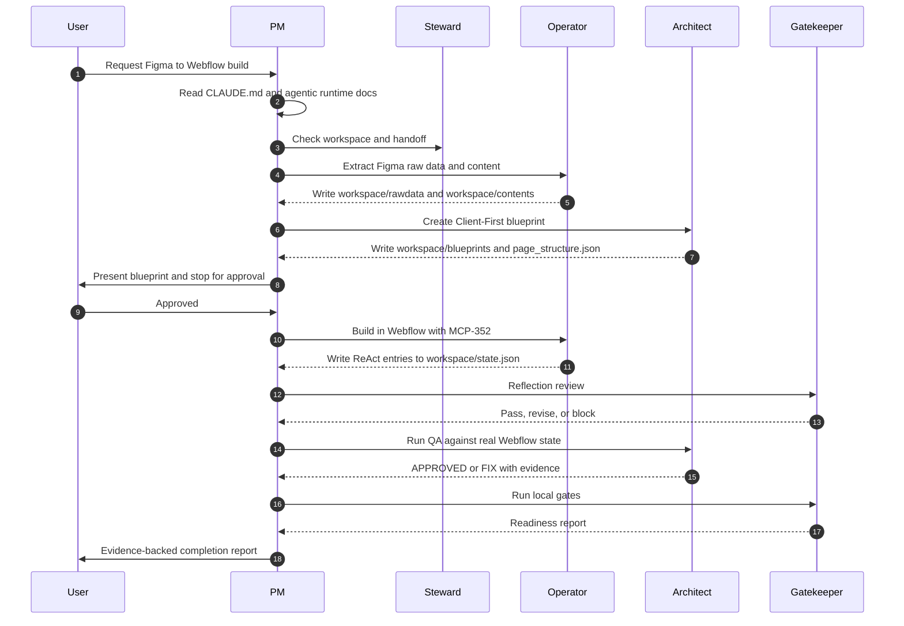

# MAS Figma to Webflow for Claude Code

This folder is a Claude Code-native, Python-first agentic workflow for converting Figma designs into Webflow pages with Finsweet Client-First V2 quality.

It now carries its own standalone architecture baseline, agent-system contract, gates, schemas, and Client-First class library so it can be used as an independent repo.

## Runtime

- Primary agent CLI: Claude Code.
- Primary automation language: Python.
- External execution: Webflow MCP and Figma connector only when explicitly approved.

## Agent Team

| Agent | Role |
|---|---|
| `pm` | User-facing orchestrator. Reads the request, controls SOP phases, delegates to specialists, reports evidence. |
| `client-first-architect` | Designs Client-First blueprints and performs QA rejection/approval. |
| `figma-webflow-operator` | Extracts Figma data and executes approved Webflow builds. |
| `workspace-steward` | Protects workspace lifecycle, archive, restore, and handoff state. |
| `qa-gatekeeper` | Runs deterministic gates and standalone readiness checks. |

Agent definitions live in `.claude/agents/`.

## Core Workflow



## Folder Map

```text
CLAUDE.md
.claude/
  agents/
  skills/
.versions/
  VERSION_HISTORY.md
agentic/
  specs/
  schemas/
  knowledge/
  memory/
  policies/
  orchestration/
  evals/
  memory/team-memory.md
  memory/session-handoff.md
  orchestration/sop.md
  policies/runtime-instructions.md
scripts/
  init_workspace.py
  archive_workspace.py
  restore_workspace.py
  gates/
tools/
  utils.py
knowledge-base/
  client-first-theory.md
workspace/       # generated runtime state, gitignored
archives/        # generated backups, gitignored
```

## Setup

Use Python 3.10 or newer.

```cmd
python scripts\init_workspace.py --project "Project Name" --figma "https://www.figma.com/design/file"
python scripts\gates\validate_agentic_structure.py --target .
python scripts\gates\run_quality_gate.py --target .
python scripts\gates\scan_secrets.py --target .
python scripts\gates\validate_agent_system_spec.py --target .
python scripts\gates\validate_skills.py --target .
python scripts\gates\validate_workspace_artifacts.py --target .
python scripts\gates\validate_phase_state.py --target .
python scripts\gates\validate_relative_paths.py --target .
python scripts\gates\validate_client_first_library.py --target .
```

Workspace lifecycle:

```cmd
python scripts\archive_workspace.py
python scripts\restore_workspace.py
python scripts\restore_workspace.py 0
```

## Hard Rules

- Claude Code is the only intended agent runtime.
- Python scripts are the active automation path.
- The PM must stop after blueprint and wait for user approval.
- Webflow writes require target site/page confirmation and approval.
- Operator must use native Webflow element operations and MCP-352.
- `whtml_builder` is prohibited.
- REM units are mandatory.
- Figma properties must be mapped through `knowledge-base/client-first-class-map.json` before class decisions are written into a blueprint.
- Workspace JSON evidence is mandatory for reports.
- Webflow action logs must include reason, action, observation, and next decision.
- Reflection review is required before risky phase closeout.
- QA approval requires actual Webflow state or snapshot evidence.
- No silent overwrite.
- Secrets must not be committed.
- Local filesystem paths in this folder must stay relative.

## Standalone Readiness

The generated system spec is at `agentic/specs/agent-system-spec.md`.

Validation targets:

- Structure profile: standard pass.
- V3 quality target: 4.7.
- Hard gates: all pass.
